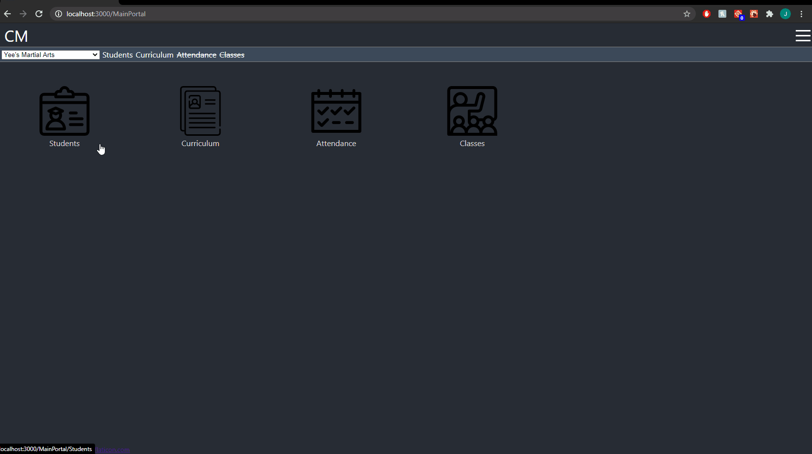
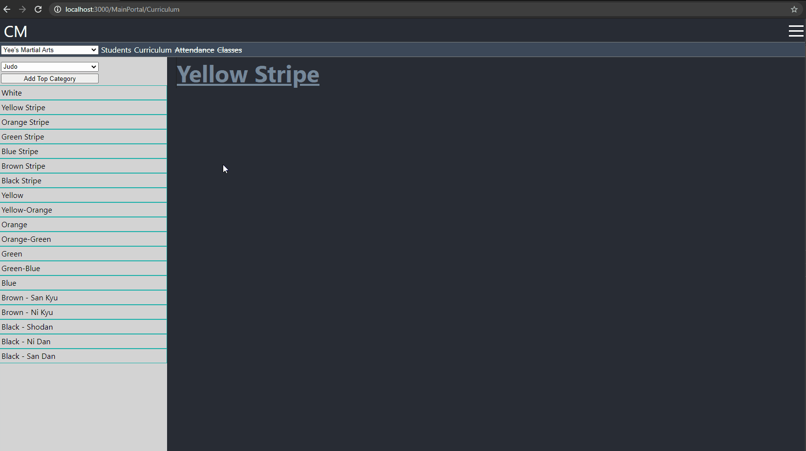
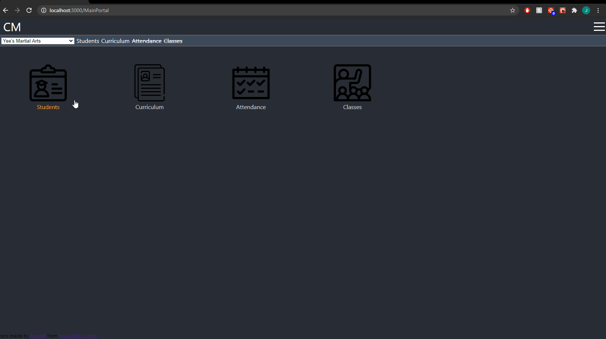
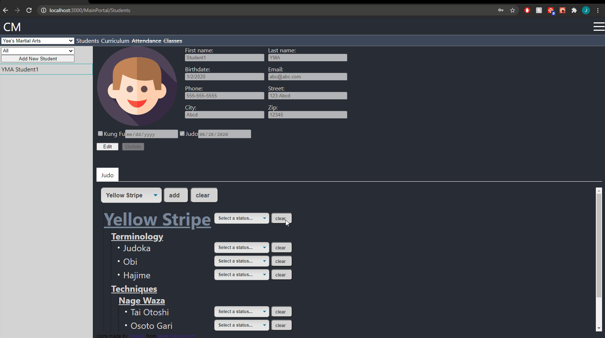
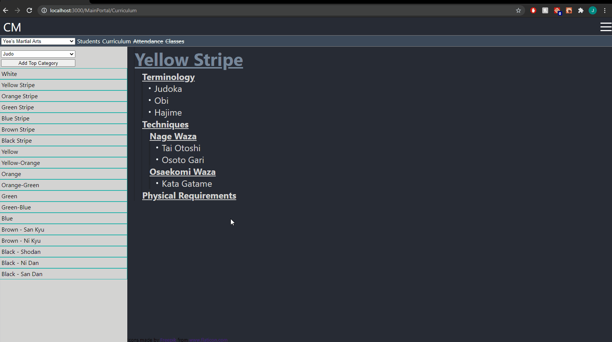
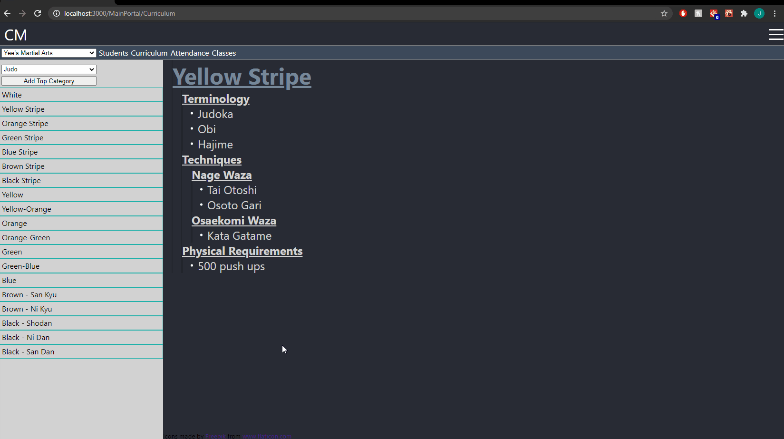

# Curriculum Manage
The story. You're a martial arts instructor that helps teach for 3 different schools. Throughout the weeks, months, and years there are other instructors teaching the students as well. Sometimes, it's hard to know what a student is working on, individual areas for them to focus on, and what their requirements are to move onto the next level. You may also want to track the history of how well they did on a particular skill or item. 

The application is designed to do this and more. 

#

Each martial arts school has their own arts, curriculums, and sets of students. The application allows the user to easily switch between all of these. Users only have access to the schools they are associated with. 

#
An example of some curriculum creation. Here we create the requirements for a yellow-stripe belt in Judo. There is no limit to the amount of categories, sub categories, or items.  

#
Here we create Student1 and do a student-curriculum association with the yellow-stripe curriculum. Students can be associated to multiple arts and curriculums.

#
For top categories, we can set their over all status. For individual category items, we can assign a proficiency level. 

#
The curriculum acts as the master list. For any category additions, deletions, edits, and (un)archiving may be performed. They can also be re-arranged using the arrow buttons. 

Let's say we decide to add 500 pushups for the yellow-stripe curriculum. Student2 will see the changes when we associate them with it, Student1 who may have already moved onto black belt will not have the changes affect them. Student1 could also be resync'd to add the 500 pushups requirement as well. 

Now, after watching Student2 practice pushups for a year, we decide that 500 pushups might be too hard for a  6 year old yellow-stripe. So we want to remove it from the curriculum without erasing  Student2's accomplishments. So we archive it. Student3 will no longer have to do 500 pushups, while we retain Student2's record.

Editing and deleting items will affect all students, so the user should be cautious when performing these actions. Editing comes in handy if we notice a mis-spelling or change a particular term. Deleting is also handy if we want to erase a category or item from existence.  

#

This concludes the major functionality of the application. There are definitely tons of enhancements, features, and improvements I will eventually implement, but will have to wait for more time to focus. 